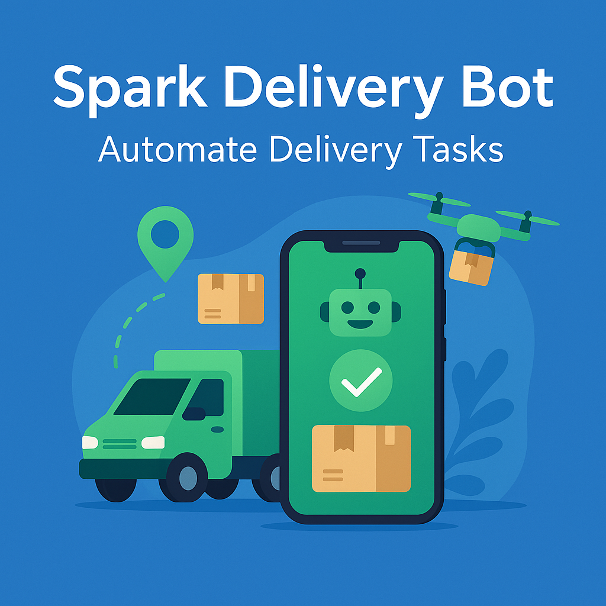

#  Spark drive best bot

<p align="center"> <a href="https://github.com/yourusername/facebook-bot">  </a> </p>

<p align="center">
  <a href="https://discord.gg/vBu9huKBvy">
    
  </a>
  <a href="https://t.me/devpilot1">
    
  </a>
</p>

---

##  Overview

**Spark Delivery Bot** automates routine delivery tasks for the Spark Delivery App. It helps delivery personnel, managers, or logistics teams streamline order processing, notifications, and tracking, saving time and reducing errors.

### Key Benefits:
- Automate **order acceptance and dispatch**  
- Track deliveries and update statuses automatically  
- Send **customer notifications** for orders in real-time  
- Multi-account support for teams or fleets  
- Human-like timing to prevent detection  
- Logging and reporting for monitoring delivery operations  

---

##  Core Features

| **Feature**                        | **Description**                                                                                  |
|------------------------------------|--------------------------------------------------------------------------------------------------|
| **Auto Accept Orders**              | Automatically accept incoming delivery requests.                                                |
| **Auto Dispatch**                   | Assign and dispatch orders to available drivers.                                                |
| **Delivery Tracking**               | Update order status in real-time for management dashboards.                                     |
| **Customer Notifications**          | Send automated messages to customers about delivery progress.                                   |
| **Multi-Account Support**           | Manage multiple delivery personnel or fleet accounts simultaneously.                            |
| **Logging & Reports**               | Keep track of accepted, dispatched, and completed orders.                                       |
| **Human-Like Timing**               | Randomized delays and pacing to mimic natural actions and prevent detection.                   |
| **Configurable Settings**           | Adjust behavior for order types, priority levels, and notification preferences.                 |

---

<p align="center">
  
</p>

##  Target Audience

- Delivery personnel using Spark Delivery App  
- Fleet managers or logistics teams  
- Developers exploring delivery automation  
- Businesses optimizing last-mile delivery  
 

---

##  Contact

- 💬 [Join Discord Community](https://discord.gg/vBu9huKBvy)  
- 📱 [Contact via Telegram](https://t.me/devpilot1)  

---

##  Installation Instructions

### 1. Clone the Repository
```bash
python -m venv .venv && source .venv/bin/activate   # Windows: .venv\Scripts\activate
pip install -r requirements.txt
uvicorn src.server:app --reload --port 8000

# open the dashboard (serve the web/ folder locally)
cd web && python -m http.server 5500
# visit http://localhost:5500, import your CSV, view stats, get maps links

